# PeaceFlow Database ERD

This schema is reconstructed from the SQL migrations in `backend/db/migrations` and cross-checked against live queries in `backend/src`.

## Mermaid ERD

```mermaid
erDiagram
    users {
        uuid id PK
        varchar email UK
        varchar phone
        text password_hash
        varchar full_name
        varchar display_name
        text avatar_url
        date date_of_birth
        enum gender
        varchar city
        varchar country
        enum status
        boolean email_verified
        boolean consent_privacy
        boolean consent_terms
        boolean consent_sensitive_data
        timestamptz last_login_at
        timestamptz created_at
        timestamptz updated_at
    }

    refresh_tokens {
        uuid id PK
        uuid user_id FK
        text token_hash
        timestamptz expires_at
        timestamptz revoked_at
        jsonb device_info
        inet ip_address
        timestamptz created_at
    }

    user_profiles {
        uuid id PK
        uuid user_id FK
        varchar occupation
        varchar relationship_status
        numeric sleep_target_hours
        int preferred_task_duration
        jsonb stress_triggers
        jsonb support_preferences
        jsonb goals
        jsonb onboarding_answers
        numeric baseline_stress_score
        numeric baseline_anxiety_score
        numeric baseline_mood_score
        jsonb personalization_weights
        timestamptz created_at
        timestamptz updated_at
    }

    mood_checkins {
        uuid id PK
        uuid user_id FK
        int mood_score
        int anxiety_score
        int stress_score
        int energy_score
        int sleep_quality_score
        varchar dominant_emotion
        jsonb triggers
        text notes
        varchar source
        timestamptz created_at
    }

    assessments {
        uuid id PK
        varchar code UK
        varchar name
        varchar version
        text description
        jsonb question_schema
        jsonb scoring_rules
        jsonb interpretation_rules
        boolean active
        timestamptz created_at
    }

    assessment_results {
        uuid id PK
        uuid user_id FK
        uuid assessment_id FK
        jsonb raw_answers
        numeric total_score
        varchar severity
        jsonb dimension_scores
        jsonb interpreted_result
        timestamptz created_at
    }

    tasks {
        uuid id PK
        varchar code UK
        varchar title
        varchar category
        varchar difficulty
        int duration_minutes
        int xp_reward
        text description
        jsonb steps
        jsonb safety_notes
        jsonb tags
        jsonb triggers_supported
        jsonb contraindications
        boolean active
        jsonb metadata
        timestamptz created_at
        timestamptz updated_at
    }

    user_task_assignments {
        uuid id PK
        uuid user_id FK
        uuid task_id FK
        text assigned_reason
        numeric recommendation_score
        enum priority_level
        enum status
        timestamptz assigned_at
        timestamptz due_at
        timestamptz completed_at
    }

    task_completions {
        uuid id PK
        uuid user_id FK
        uuid task_id FK
        uuid assignment_id FK
        text completion_notes
        int self_rating_before
        int self_rating_after
        int duration_actual
        int xp_earned
        timestamptz created_at
    }

    user_progress {
        uuid id PK
        uuid user_id FK
        int total_xp
        int current_level
        int current_streak
        int longest_streak
        date last_activity_date
        int badges_count
        timestamptz updated_at
    }

    badges {
        uuid id PK
        varchar code UK
        varchar name
        text description
        jsonb criteria
        varchar icon
        varchar rarity
        timestamptz created_at
    }

    user_badges {
        uuid id PK
        uuid user_id FK
        uuid badge_id FK
        timestamptz earned_at
    }

    journal_entries {
        uuid id PK
        uuid user_id FK
        varchar title
        text content
        int mood_before
        int mood_after
        numeric sentiment_score
        jsonb tags
        boolean is_private
        timestamptz created_at
        timestamptz updated_at
    }

    risk_snapshots {
        uuid id PK
        uuid user_id FK
        numeric current_stress_index
        numeric current_anxiety_index
        numeric sleep_risk_index
        numeric burnout_risk_index
        enum crisis_risk_level
        jsonb recommendation_profile
        jsonb explanation
        timestamptz calculated_at
    }

    emergency_logs {
        uuid id PK
        uuid user_id FK
        enum event_type
        jsonb payload
        timestamptz created_at
    }

    audit_logs {
        uuid id PK
        uuid user_id FK
        varchar action
        varchar entity_type
        uuid entity_id
        jsonb metadata
        inet ip_address
        text user_agent
        timestamptz created_at
    }

    recommendation_logs {
        uuid id PK
        uuid user_id FK
        uuid snapshot_id FK
        jsonb recommended_tasks
        jsonb context
        timestamptz created_at
    }

    experts {
        uuid id PK
        varchar code UK
        varchar full_name
        text degree
        varchar avatar_emoji
        varchar status
        numeric rating
        int sessions_count
        numeric satisfaction_rate
        int base_price
        varchar location
        int experience_years
        jsonb specialties
        jsonb tags
        text bio
        jsonb credentials
        jsonb approaches
        varchar next_slot_label
        boolean active
        jsonb metadata
        timestamptz created_at
        timestamptz updated_at
    }

    expert_bookings {
        uuid id PK
        uuid user_id FK
        uuid expert_id FK
        varchar session_type
        timestamptz starts_at
        int duration_minutes
        int price
        text notes
        varchar status
        timestamptz created_at
        timestamptz updated_at
    }

    community_posts {
        uuid id PK
        uuid user_id FK
        varchar author_name
        varchar author_avatar
        text content
        varchar category
        jsonb tags
        boolean is_anonymous
        boolean is_positive
        timestamptz created_at
        timestamptz updated_at
    }

    community_comments {
        uuid id PK
        uuid post_id FK
        uuid user_id FK
        varchar author_name
        varchar author_avatar
        text content
        boolean is_anonymous
        timestamptz created_at
    }

    community_reactions {
        uuid id PK
        uuid post_id FK
        uuid user_id FK
        varchar reaction_type
        timestamptz created_at
    }

    users ||--o{ refresh_tokens : owns
    users ||--o| user_profiles : has
    users ||--o{ mood_checkins : records
    users ||--o{ assessment_results : submits
    assessments ||--o{ assessment_results : defines
    users ||--o{ user_task_assignments : receives
    tasks ||--o{ user_task_assignments : assigned
    users ||--o{ task_completions : completes
    tasks ||--o{ task_completions : completed
    user_task_assignments o|--o{ task_completions : source
    users ||--o| user_progress : tracks
    users ||--o{ user_badges : earns
    badges ||--o{ user_badges : awards
    users ||--o{ journal_entries : writes
    users ||--o{ risk_snapshots : snapshots
    users o|--o{ emergency_logs : triggers
    users o|--o{ audit_logs : acts
    users ||--o{ recommendation_logs : receives
    risk_snapshots o|--o{ recommendation_logs : backs
    users ||--o{ expert_bookings : books
    experts ||--o{ expert_bookings : serves
    users o|--o{ community_posts : authors
    community_posts ||--o{ community_comments : has
    users o|--o{ community_comments : comments
    community_posts ||--o{ community_reactions : has
    users ||--o{ community_reactions : reacts
```

## Main domains

- `users`, `refresh_tokens`, `user_profiles`: account and profile core.
- `mood_checkins`, `journal_entries`, `assessment_results`, `risk_snapshots`: time-series mental health data.
- `tasks`, `user_task_assignments`, `task_completions`, `recommendation_logs`: task recommendation and completion flow.
- `user_progress`, `badges`, `user_badges`: gamification.
- `experts`, `expert_bookings`: expert consultation.
- `community_posts`, `community_comments`, `community_reactions`: community features.
- `emergency_logs`, `audit_logs`: safety and audit.

## Enums

- `user_status`: `active | inactive | suspended | deleted`
- `gender_type`: `male | female | other | prefer_not_to_say`
- `task_status`: `assigned | in_progress | completed | skipped | expired`
- `priority_level`: `low | medium | high | critical`
- `crisis_level`: `low | moderate | high | critical`
- `emergency_event_type`: `hotline_view | breathing_tool | panic_mode | trusted_contact | expert_request | crisis_flag`

## Important notes

- `journal_entries` is the journal table actively used by backend routes and services.
- `user_journals` exists in migration `0013_journals.sql` but is not referenced in `backend/src`; it looks like a legacy or redundant table.
- `user_profiles.user_id` and `user_progress.user_id` are `unique`, so their logical relationship with `users` is 1-1.
- `task_completions.assignment_id` is nullable and has no unique constraint, so a single assignment can produce multiple completion rows at the schema level.
- Tables with `updated_at` are auto-maintained by triggers from `0011_triggers.sql`: `users`, `user_profiles`, `tasks`, `journal_entries`, `user_progress`.
